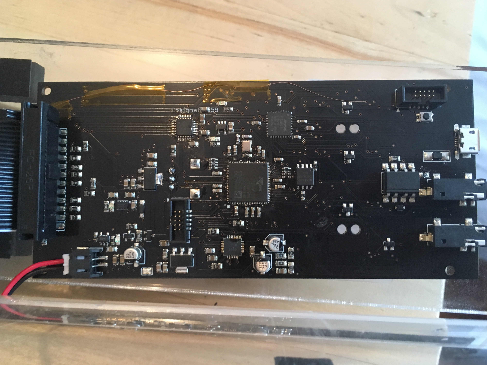

# bfin-fm
FM synthesis library for blackfin+

This is code for FM synthesis on BF70x Blackfin+ DSP chips.
Demo videos can be seen [here](https://youtu.be/4m1YorzgxkY) and [here](https://youtu.be/Mct14THKZX8)

The code running in the second demo is [this example](https://github.com/deanm1278/bfin-fm/blob/master/examples/patcher/patcher.ino)
It is a 6 operator synthesizer with 16 voices of polyphony and 1 global LFO.
The parameters are controlled through MIDI messages sent via MAX MSP.

## Dependencies
This code depends on:
* [GNU toolchain for blackfin+](https://github.com/deanm1278/blackfin-plus-gnu)
* [BF706 header files](https://github.com/deanm1278/bfin-CMSIS)
* [Blackfin+ Arduino Core](https://github.com/deanm1278/ArduinoCore-blackfin)
* [Blackfin+ AudioFX Library](https://github.com/deanm1278/audioFX)
